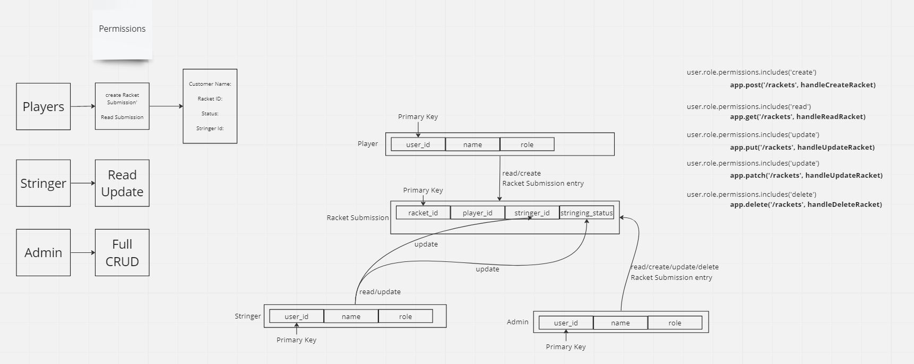

# syntax-savants

## Problem Domain
This API manages badminton racket stringing requests. A player can create a request to have their rackets strung and read the status of their requests. Stringers(employees) can update the status of a request and read the requests. Admins can perform all CRUD operations on a stringing request. 

## Server

URL:  

## UML

## GitHub Actions

- [Actions]

## GitHub PRs

- [All PRs](https://github.com/AnthonyKeith15/syntax-savants/pulls)
